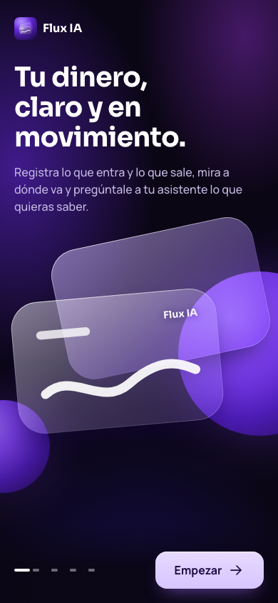
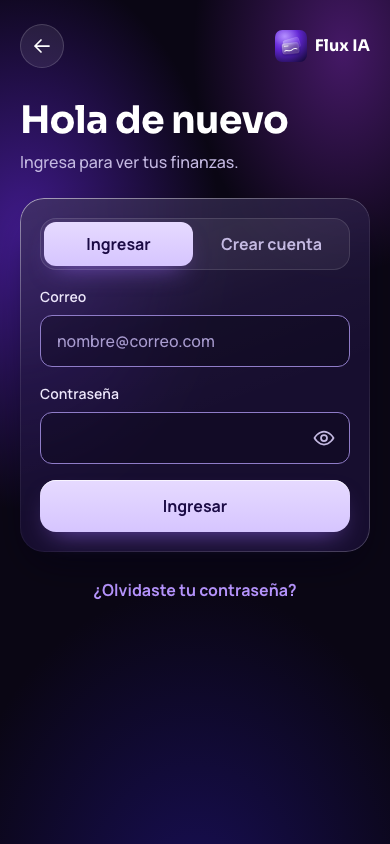
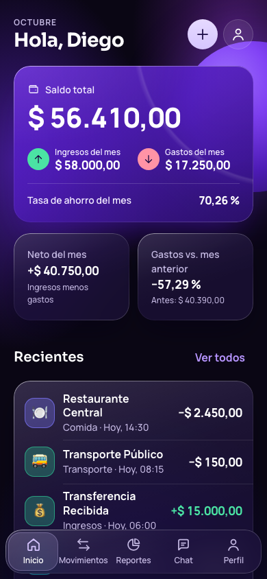
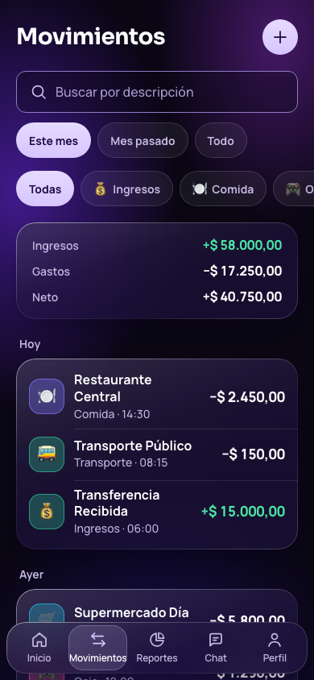
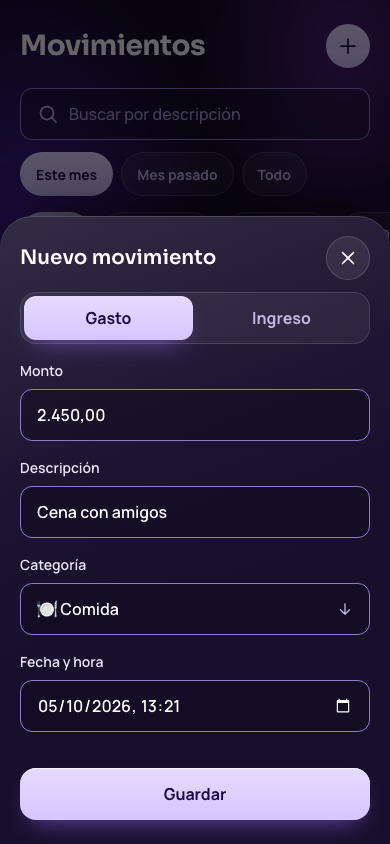
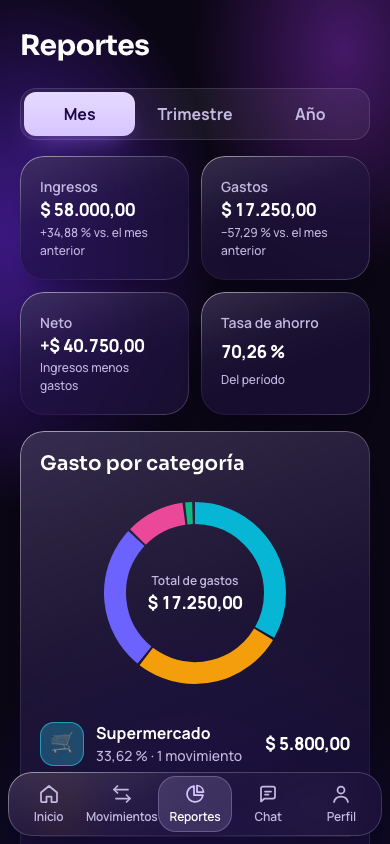
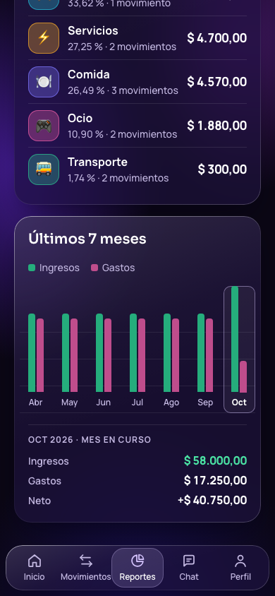
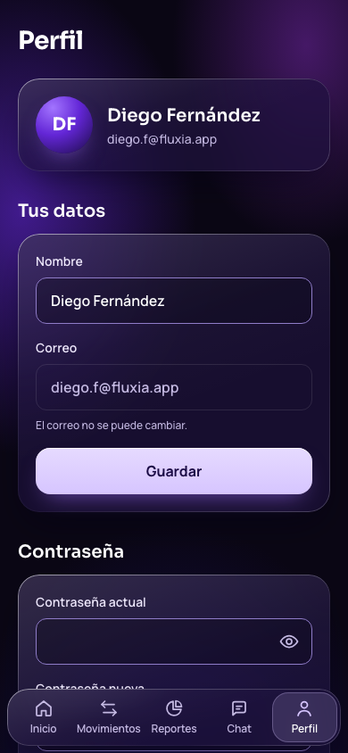

# Flux IA

**Flux IA** es una app de finanzas personales con un asistente de IA. Registras
tus ingresos y gastos, ves a dónde va tu dinero en reportes y le preguntas al
asistente cosas como «¿en qué gasté más este mes?». El asistente responde con
tus movimientos reales, calculados en el servidor.

El repositorio tiene las dos partes del proyecto:

| Carpeta | Qué contiene |
|---|---|
| [`backend/`](backend/) | API REST en Java 21 + Spring Boot + PostgreSQL. Toda cifra se calcula aquí. |
| [`frontend/`](frontend/) | App móvil en HTML, CSS y JavaScript puros, instalable como PWA. |
| [`docs/`](docs/) | Arquitectura, auditoría del prototipo, capturas y el prototipo original. |

## Capturas

Datos de la semilla de prueba, a 390×844.

<table>
  <tr>
    <td align="center"><br>Bienvenida</td>
    <td align="center"><br>Ingresar</td>
    <td align="center"><br>Inicio</td>
  </tr>
  <tr>
    <td align="center"><br>Movimientos</td>
    <td align="center"><br>Nuevo movimiento</td>
    <td align="center"><br>Reportes</td>
  </tr>
  <tr>
    <td align="center"><br>Tendencia mensual</td>
    <td align="center"><br>Chat</td>
    <td align="center"><br>Perfil</td>
  </tr>
</table>

## Tecnologías

**Backend**

| Pieza | Versión | Para qué |
|---|---|---|
| Java | 21 (LTS) | Lenguaje |
| Spring Boot | 3.5 | Web, seguridad e inyección de dependencias |
| PostgreSQL | 13 o superior | Base de datos (local o Supabase) |
| Flyway | 11 | Migraciones versionadas del esquema |
| Spring Security + jjwt | 6.5 / 0.13 | Autenticación con JWT |
| springdoc-openapi | 2.9 | Documentación navegable en `/docs` |
| anthropic-java | 2.68 | SDK oficial para el asistente de IA |

**Frontend**

| Pieza | Para qué |
|---|---|
| HTML, CSS y JavaScript (módulos ES) | Sin frameworks ni paso de build |
| GSAP 3 + ScrollTrigger (cdnjs) | Animación de apertura, *parallax* y gráficos |
| Sora y Manrope (OFL, incluidas) | Tipografía, también sin conexión |
| Web App Manifest | App instalable con ícono propio |

## Estructura

```
Flux IA/
├── backend/        API REST (Spring Boot)        → backend/README.md
│   ├── src/main/java/com/fluxia/backend/   un paquete por concepto
│   ├── src/main/resources/db/              migraciones y semilla de prueba
│   └── .env.example                        plantilla de configuración
├── frontend/       app móvil (HTML/CSS/JS)       → frontend/README.md
│   ├── index.html, js/, css/, assets/
│   ├── DESIGN.md                           sistema de diseño
│   └── styleguide.html                     el sistema de diseño en vivo
├── docs/
│   ├── arquitectura.md
│   ├── auditoria-prototipo.md
│   ├── capturas/
│   └── prototipo-movil.html                prototipo original (ver abajo)
├── CLAUDE.md       convenciones del proyecto
└── README.md
```

## Cómo ejecutarlo

### Requisitos

- **JDK 21.** No hace falta instalar Maven: el proyecto trae el *wrapper*.
- **PostgreSQL**, local o en Supabase.
- **VS Code con la extensión Live Server**, para servir el frontend.

### 1. Configurar el backend

```bash
cd backend
cp .env.example .env
```

Edita `backend/.env` con los datos de tu base (`DB_URL`, `DB_USERNAME`,
`DB_PASSWORD`) y una clave de firma propia:

```bash
openssl rand -base64 48   # pega el resultado en JWT_SECRET
```

Sin clave de IA, deja `AI_ENABLED=false`: todo funciona salvo el chat, que lo
avisa con un mensaje claro.

> **Si usas Supabase:** la conexión directa solo tiene IPv6. En una red sin
> IPv6 el backend no arranca (`No route to host`) y hay que usar el *pooler*
> de Supabase, que sí tiene IPv4. Está explicado en `backend/.env.example`.

### 2. Levantar el backend con datos de prueba

Desde `backend/`:

```bash
SPRING_PROFILES_ACTIVE=dev ./mvnw spring-boot:run
```

El perfil `dev` crea las tablas y carga la semilla con el usuario de prueba.
Cuando el log diga `Started FluxIaApplication`, la API responde en
`http://localhost:8080` y su documentación en
**http://localhost:8080/docs**.

### 3. Abrir el frontend

En VS Code, clic derecho sobre `frontend/index.html` → **Open with Live
Server**. Se abre en `http://127.0.0.1:5500/frontend/index.html`.

Para verla con tamaño de teléfono: herramientas de desarrollador → modo
dispositivo → 390×844. En una ventana normal se ve dentro de un marco de
teléfono.

### 4. Ingresar

**Usuario de prueba:** `diego.f@fluxia.app` / `Flux2026!`

## API

Base: `http://localhost:8080/api/v1`. Todos los endpoints exigen
`Authorization: Bearer <token>`, salvo los de `/auth`. La referencia completa,
con ejemplos, está en **http://localhost:8080/docs** y en
[backend/README.md](backend/README.md).

| Grupo | Endpoints |
|---|---|
| Autenticación | `POST /auth/register`, `/auth/login`, `/auth/refresh`, `/auth/logout`, `/auth/forgot-password`, `/auth/reset-password` |
| Perfil | `GET` y `PATCH /me`, `POST /me/password` |
| Cuentas y categorías | `GET` y `POST /accounts`, `GET` y `POST /categories`, `DELETE /categories/{id}` |
| Movimientos | `GET /transactions` (filtros y totales), `GET /transactions/recent`, `GET`, `PATCH` y `DELETE /transactions/{id}`, `POST /transactions` |
| Reportes | `GET /reports/summary`, `/reports/by-category`, `/reports/monthly-trend` |
| Asistente | `POST /ai/chat` |

## Decisiones de diseño

**1. Una sola fuente de verdad.** Toda cifra (saldo, reportes, contexto de la
IA) sale de un `SUM()` sobre la tabla `transactions`. El frontend no suma ni
calcula porcentajes: los pide a la API. El prototipo original mostraba cuatro
cifras distintas para el mismo mes; está documentado en
[docs/auditoria-prototipo.md](docs/auditoria-prototipo.md).

**2. Dinero sin coma flotante.** `BigDecimal` y `NUMERIC(14,2)` en el backend.
El frontend envía los montos como texto (`"2450.50"`) y solo los formatea.

**3. Montos siempre positivos; el sentido va en `type`.** Un gasto mal firmado
no puede inflar el saldo.

**4. Aislamiento por usuario.** El `userId` sale siempre del token, nunca de un
parámetro. Un recurso ajeno devuelve 404 y no 403, para no confirmar que existe.

**5. La clave de la IA vive solo en el servidor.** El frontend llama a
`POST /api/v1/ai/chat`; el backend arma el contexto con los datos del usuario y
habla con el modelo.

**6. Sesión en el frontend.** El `accessToken` (15 min) vive en memoria y el
`refreshToken` en `localStorage`, para que recargar no cierre la sesión. El
riesgo es que un script inyectado lea `localStorage`, así que ningún texto de la
API, del usuario ni de la IA entra con `innerHTML`.

**7. Sin frameworks en el frontend.** No hay `npm install` ni compilación que
configurar para evaluar el proyecto: lo que se lee es lo que corre.

**8. Sistema de diseño medido.** Colores, tipografía, vidrio y movimiento están
en [frontend/DESIGN.md](frontend/DESIGN.md), con el contraste de cada texto
calculado sobre el peor caso. El movimiento respeta `prefers-reduced-motion`.

Más detalle en [docs/arquitectura.md](docs/arquitectura.md) y las convenciones
en [CLAUDE.md](CLAUDE.md).

## Pruebas

```bash
cd backend
./mvnw test
```

24 pruebas unitarias sobre los cálculos: límites de períodos, convención de
signos, porcentajes del gráfico, tasa de ahorro y variaciones. No necesitan base
de datos. El SQL se valida al arrancar contra PostgreSQL: con
`ddl-auto=validate`, el servidor no arranca si el esquema y las entidades
difieren.

El frontend se verificó de punta a punta contra el backend con la semilla:
ingreso, registro, recuperación, crear, editar y borrar movimientos, filtros,
reportes, chat sin IA y perfil, a 360 y 390 px de ancho y con movimiento
reducido. Esas pruebas se hicieron con un navegador automatizado y no están en
el repositorio (ver pendientes).

## El prototipo original

[`docs/prototipo-movil.html`](docs/prototipo-movil.html) es el prototipo con el
que empezó el proyecto, cuando se llamaba «PagoIA». Se conserva como referencia
del flujo de pantallas. Sus cifras estaban escritas a mano y no cuadraban entre
sí; la auditoría explica por qué el backend las calcula.

## Pendientes

1. **Servicio de correo** para la recuperación de contraseña. Hoy, en el perfil
   `dev`, el código vuelve en la respuesta y la app lo carga sola.
2. **Service worker** para usar la app sin conexión. Solo debe guardar en caché
   los archivos de la app, nunca respuestas de la API.
3. **Pruebas automatizadas del frontend** en el repositorio.
4. **Mensajes del backend con tildes:** varios dicen «contrasena» o «valido».
5. **Colores de categoría para fondo oscuro:** los de la API vienen del
   prototipo claro; hoy se compensa en el frontend.
6. **Producción:** apagar `/docs`, limitar la frecuencia de peticiones en
   `/auth/login` y `/ai/chat`, y limpiar periódicamente los tokens vencidos
   (ver CLAUDE.md).
